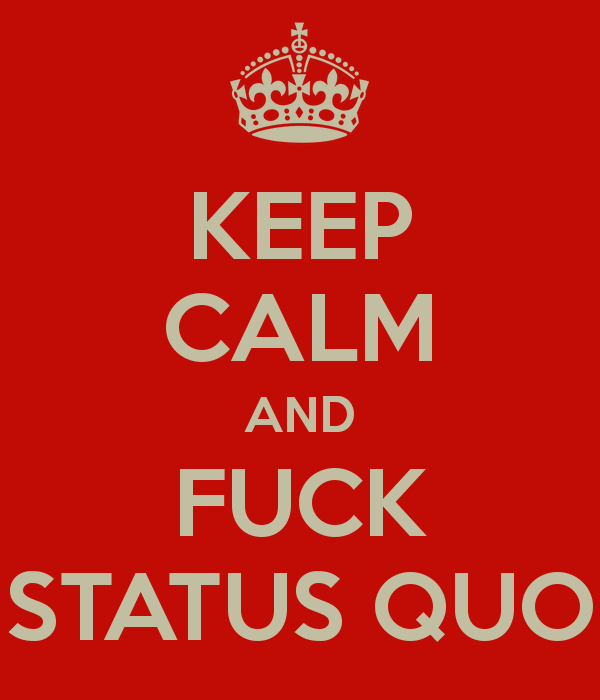

<!-- 
$theme: default  
-->

<!-- 
$size: 16:9 
-->
<!-- 
page_number: 
true -->

---

### `/usr/bin/whoami`
# `Diego Hernandes`

#### `cat /etc/issue`
# `hernandev`

---

</img> 

<a style="font-size: 50px; padding-top: 60px; display:block" href="https://github.com/hernandev">https://github.com/hernandev</a>

---

## Kino Contabilidade Online
###### CTO

https://sejakino.com.br

---

## CODECASTS
###### Co-Founder

https://codecasts.com.br

---

# Why Patterns Exists?

---

# Why Patterns Exists?

- Someone already tought about that.

---

# Why Patterns Exists?

- Someone already tought about that.
- Like any other knowledge, it's intended to evolve and cary years of research and test.

---

# So why are they a bad thing?

---

# So ~~<b style="color: #ccc">why</b>~~ <b style="color: #ff0000">when</b> are they a bad thing?

---

###### *When you start trusting them so blindly that you forget to think.*

---

---

# Give me some examples, Bitch!

---

# 1 - Fuck ~~<b style="color: #ccc">Peter Chen</b>~~ Database Normalization
That includes using SQL for everything.

---

# 1 - Fuck ~~<b style="color: #ccc">Peter Chen</b>~~ Database Normalization
That includes using SQL for everything.

## Why?

- I/O Performance.
- Crazy Scalability. 

---

# 1 - Fuck ~~<b style="color: #ccc">Peter Chen</b>~~ Database Normalization
That includes using SQL for everything.

## How?

- Collections, alone, solve most of the problems.
- Let Database handle only what you can't.

---

# 2 - Fuck ~~<b style="color: #ccc">College</b>~~ Education.

Why pay for something you can get for free?

---

# 2 - Fuck ~~<b style="color: #ccc">College</b>~~ Education.

Why pay for something you can get for free?

## Reasons:

- Anything CS related is freely available online.
- No grades, means no pressure.
- Focus on what you really wanna learn.

---

# 2 - Fuck ~~<b style="color: #ccc">College</b>~~ Education.

## Biggest Reason:
### - The market does not give a fuck.

---

# 3 - Ignore Design Patterns and Abuse Anti-Patterns
But do so with extremely caution.

---

# 3 - Ignore Design Patterns and Abuse Anti-Patterns

## Why?
- Sometimes, you just gotta Deliver.

---

# 4 - Avoid the Hype
Cause Angular 4.0 is on it's way and you haven't figured out how Angular.JS 1.0 works yet.

---

# 5 - MVP means MVP. It does not need to be good.

Cause there's nothing worse than over-architect a no-users app.

---

# 6 - Fuck Stability! Quit your Job, Now.
I'm serious, text you boss right now and let him know you're not gonna work tomorrow.

---

# 6 - Fuck Stability! Quit your Job, Now.

## Why?

- You're not gonna be rich there.
- You're not having enough challenges to shapen your mind.
- You co-workers are idiots.
- The coffee sucks.
- The code sucks even more than the coffe.

---

# 6 - Fuck Stability! Quite your Job, Now.

## Why?

- Make sure you have some money stash (make one of you don't).
- Get some friends and create an awesome SaaS.
- If you don't wanna build something, at least work remotely, your wife is gonna love! (or hate, both way better know).
- If everything fails, get another job.
- Start again on the previous slide tips.

---

# 7 - Quit Working. P-e-r-i-o-d.
Start thinking. It's really, really fun.

---

# 7 - Quit Working. P-e-r-i-o-d.
Start thinking. It's really, really fun.

## Why?

 - The more you work, the less you get done.

---

# 7 - Quit Working. P-e-r-i-o-d.
Start thinking. It's really, really fun.

## How?

 - Put your mind at automation.
 - Put your mind at creation.
 - Put your mind at design.
 - Put your mind at architecture.

---

# 8 - LESS <b style="color: #00FF00">Friends</b>, MORE <b style="color: #FF0000">Enemies</b>.

*"We are the average of the five people we spend the most time with"* -  **Jim Rohn**

---

# 8 - LESS <b style="color: #00FF00">Friends</b>, MORE <b style="color: #FF0000">Enemies</b>.
*"We are the average of the five people we spend the most time with"* -  **Jim Rohn**

## How?
- Keep only friends who have something to offer you.
- Enemies and/or rivals are the ultimate source of ideas. 

---

# 9 - Pursue <b style="color: #00FF00">Success</b> at <b style="color: #FF0000">Any Cost</b>

What's your legacy?

---

# 9 - Pursue <b style="color: #00FF00">Success</b> at <b style="color: #FF0000">Any Cost</b>

What's your legacy?

- self note: tell Erich Thomas history that does not fit into a slide.

---

# 10 - Learn the Fucking Javascript

Master it. You already need it. You just don't know yet.

---

### That's all folks!

### You can cry now.

# Get you there and Fuck it!